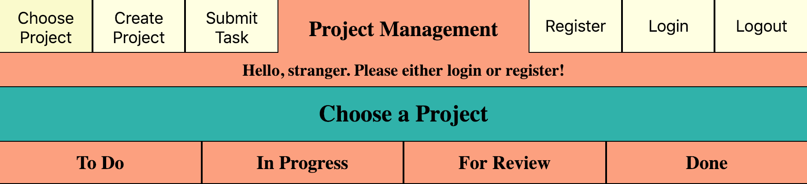
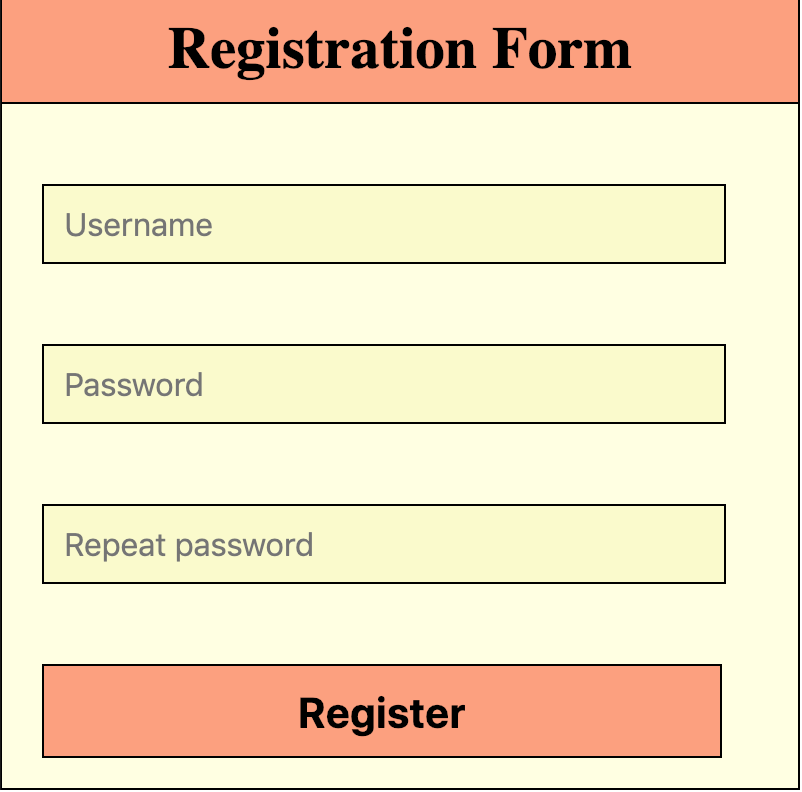
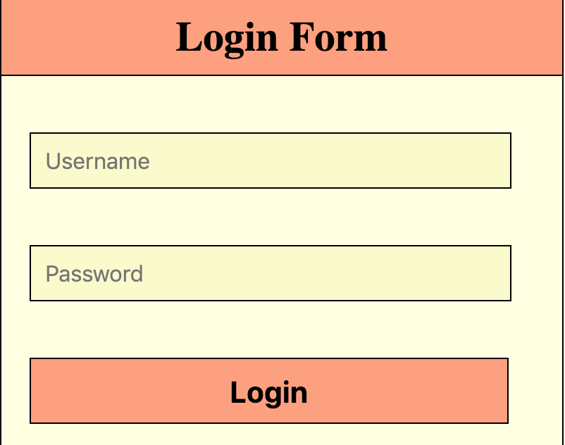
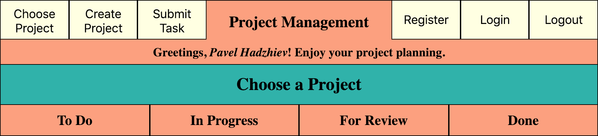
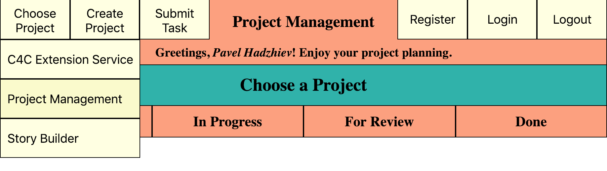
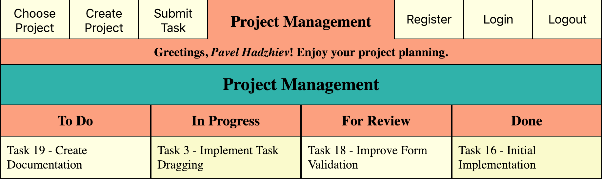
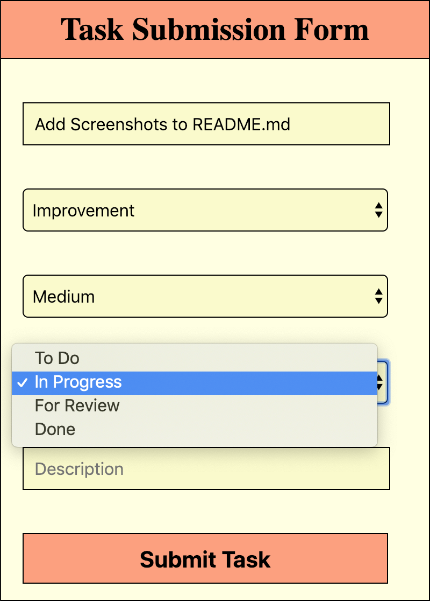
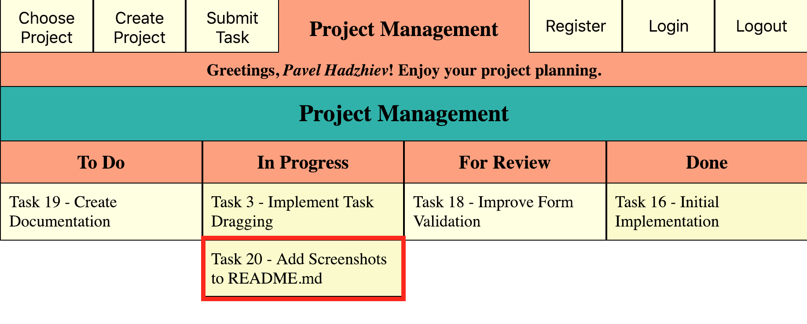

# Project Manager

Project Manager is an application to organize tasks in your agile-driven projects. 

## Authentication

To start using Project Manager, you have to first authenticate. Either register as a new user

or log in as an existing one.

Once logged in, you are good to go!

## Project Management

Once you are authenticated, you can start managing your projects.

### Choose a Project

Navigate to the __Choose Project__ button and choose an existing project from the dropdown menu.

If you want to create a new project, you can do so via the __Create Project__ button.

## Task Management

Once you have selected a project, you can view your existing tasks. Task

### Submit a Task

You can also submit a new task, via the __Submit Task__ button. Tasks have uniquely generated IDs, so they can be easily referred. Name your task, select the task type, priority and status, put in a detailed description and submit your task.

See your freshly submitted task in the project view.

#### Disclaimer

This is a project for my university course for web development and has only educational purposes.
